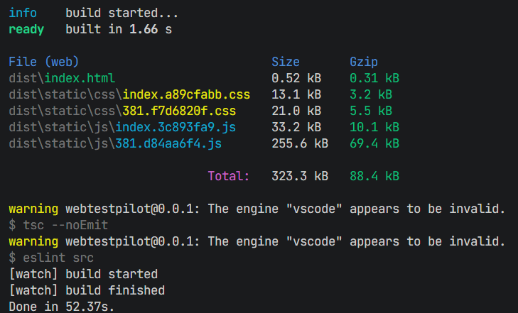
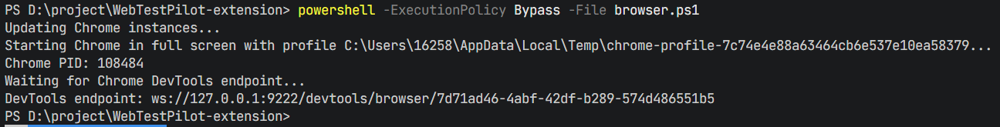
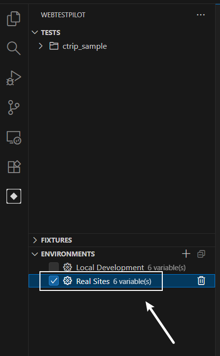
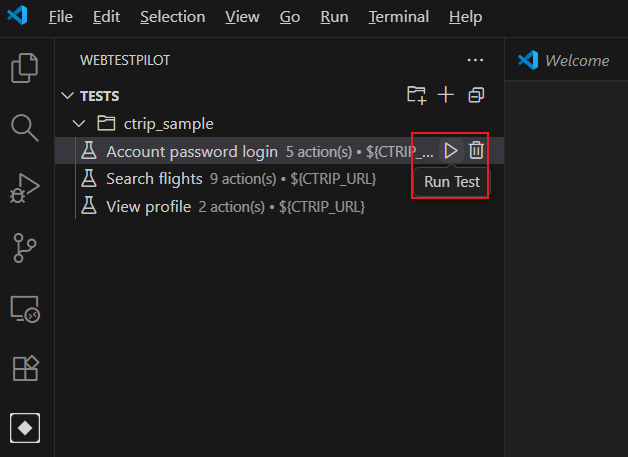
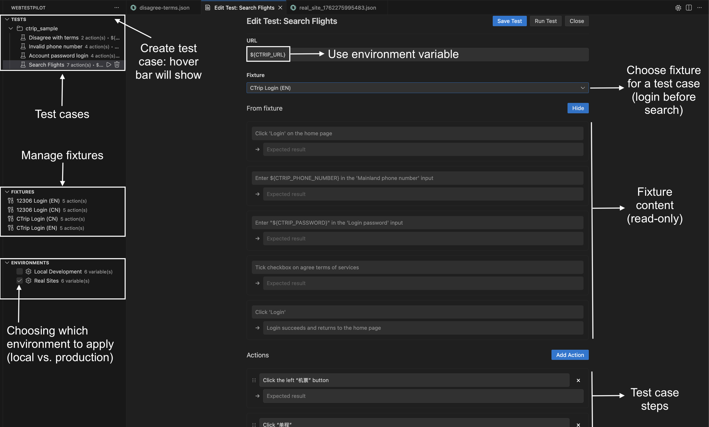

# WebTestPilot

[](https://opensource.org/licenses/MIT) [](https://nodejs.org/)

An AI-powered VS Code extension for automated web testing and test case generation.

## Table of Contents

- [Prerequisites](#prerequisites)
- [Installation](#setup)
- [Usage](#usage)

## Demo
[](https://youtu.be/nKLzdujmIbE)

## Clone repo
```bash
git clone --recurse-submodules https://github.com/code-philia/WebTestPilot-extension.git
cd WebTestPilot-extension
git submodule sync --recursive
git submodule update --init --recursive
```

## Prerequisites

- [Google Chrome](https://www.google.com/chrome/) installed locally
- Node.js >= 22.9.0
- Python 3.12

## Setup
#### Setup environement variables
```bash
# Copy sample .env file
cp .env.example .env

# Fill in the OPENAI_API_KEY in .env ...
```

#### Install uv
Install uv using the following scripts:
```bash
# For MacOS
curl -LsSf https://astral.sh/uv/install.sh | sh

# For Windows
powershell -ExecutionPolicy ByPass -c "irm https://astral.sh/uv/install.ps1 | iex"

# Test the command
uv
```

For more details, refer to [original uv document](https://docs.astral.sh/uv/getting-started/installation/#__tabbed_1_1).

#### Setup Extension
```bash
# If don't have yarn
npm install --global yarn

# MacOS / Linux / WSL
source setup.sh

# Windows
powershell -ExecutionPolicy Bypass -File setup.ps1
```
if you see the output below, it means the extension is installed successfully.


## Usage
#### Start the Development Server
1. Start chrome browser instance: 
``` bash
# MacOS / Linux / WSL
source browser.sh

# Windows
powershell -ExecutionPolicy Bypass -File browser.ps1
```
you will see this output and a chrome browser instance opened.


2. Open file `src/extension.ts`.
3. Press `Ctrl+Shift+P` (or `Cmd+Shift+P` on Mac) and search for command: "Debug: Start Debugging", click it and choose "VS Code Extension Development".


#### Open the Testcase Folder
1. In the extension debug window (with the title of "[Extention Development Host]"), open the sample folder inside the WebTestPilot-extension folder.
2. Press `Ctrl+Shift+P` and type "WebTestPilot: Set Workspace...", then select the WebTestPilot-extension folder.


#### Run and Add Testcase
1. Click the WebTestPilot extension icon in the sidebar.

2. Check the "Real Sites" option in the WebTestPilot sidebar for running test on real websites.

3. Click "Run test" to run single test.

4. Write your own testcases in json format in the `sample` folder, and back to WebTestPilot sidebar to run the test.


### In case of updates
When there are updates to the code base, run the following command and then restart the extension.

First, update build
```bash
# MacOS / Linux / WSL
source setup.sh

# Windows
sh setup.sh
```

Second, restart the extension. Click the restart button here (after debugging started)


or, stop the debugger and start again:


## Instructions how to use WebTestPilot

A walkthrough demo of WebTestPilot
[](https://youtu.be/nKLzdujmIbE)

There are 3 main functionalities of WebTestPilot:
- Test cases: steps to perform (i.e. "Click Login button") and its expected result (i.e. "Login screen show up").
- Fixtures: shared common steps before a test case, i.e. many test cases need login, we can have a fixture for login.
- Environment variables: we define common variables such as WEBSITE_URL, USERNAME, PASSWORD, ... these can be used in fixtures and test cases in the form of `${WEBSITE_URL}`.

Examples: fixtures, testcases and environments in ./sample.

This image shows how all three functionalities can be used together.


