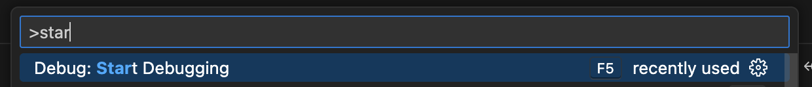
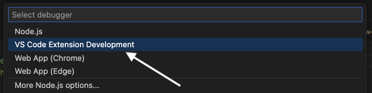
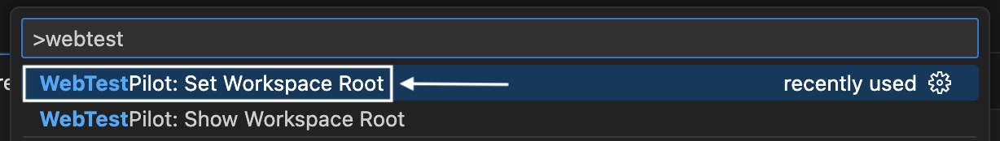
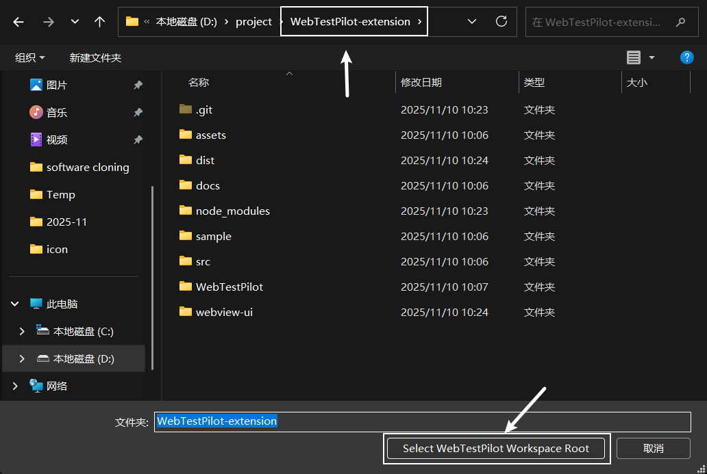
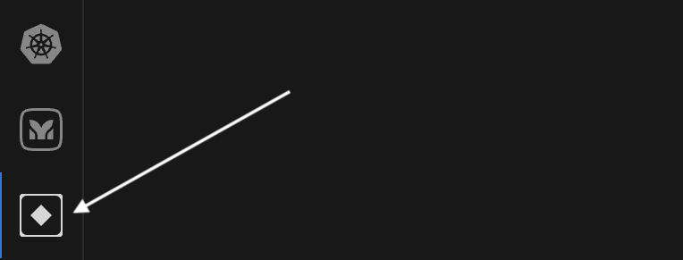
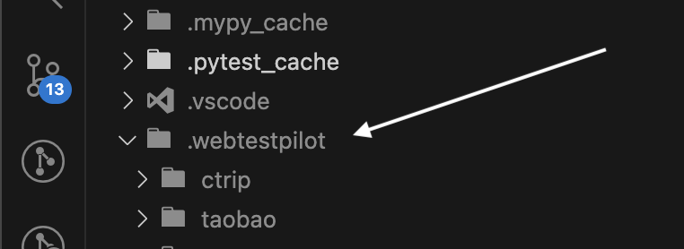
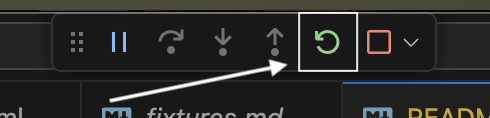
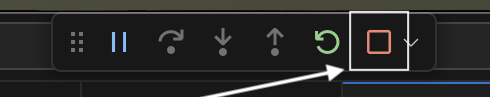

# WebTestPilot

[](https://opensource.org/licenses/MIT) [](https://nodejs.org/)

An AI-powered VS Code extension for automated web testing and test case generation.

## Table of Contents

- [Prerequisites](#prerequisites)
- [Installation](#installation)
- [Usage](#usage)

## Clone repo
```bash
git clone --recurse-submodules https://github.com/code-philia/WebTestPilot.git
```

## Prerequisites

- [Google Chrome](https://www.google.com/chrome/) installed locally
- Node.js >= 22.9.0
- Python 3.12
- uv

## Setup WebTestPilot Runtime

#### Install Chrome
Install Chrome from instructions here [Google Chrome](https://www.google.com/chrome/).

#### Install uv
Install uv using the following scripts:
```bash
# For MacOS
curl -LsSf https://astral.sh/uv/install.sh | sh

# For Windows
powershell -ExecutionPolicy ByPass -c "irm https://astral.sh/uv/install.ps1 | iex"

# Test the command
uv
```

For more details, refer to [original uv document](https://docs.astral.sh/uv/getting-started/installation/#__tabbed_1_1).

### Setup Extension
```bash
# Node 22
nvm install lts/jod
nvm use lts/jod

# If don't have yarn
npm install --global yarn

# MacOS / Linux / WSL
source setup.sh

# Windows
sh setup.sh
```

## Usage
### Get seed data
```bash
cp -r sample/.webtestpilot ./.webtestpilot
```

### Start the Development Server
1. Start chrome browser instance: ```source browser.sh```
2. Open `src/extension.ts` in a new VS Code window.
3. Press `Ctrl+Shift+P` (or `Cmd+Shift+P` on Mac) and type "Debug: Start Debugging", then select it.

4. Press `Ctrl+Shift+P` (or `Cmd+Shift+P` on Mac) and type "Debug: Start Debugging", then select it.


5. In the extension debug window, open the WebTestPilot-extension folder inside it.
6. Press `Ctrl+Shift+P` and type "WebTestPilot: Set Workspace...", then select the WebTestPilot folder.



7. Click the WebTestPilot extension icon in the sidebar to start using it.

8. In the debugger window, open a folder in it.
9. Put the given test cases into .webtestpilot folder of the opened folder in the Extension Development Host window.


### In case of updates
When there are updates to the code base, run the following command and then restart the extension.

First, update build
```bash
# MacOS / Linux / WSL
source setup.sh

# Windows
sh setup.sh
```

Second, restart the extension. Click the restart button here (after debugging started)


or, stop the debugger and start again



