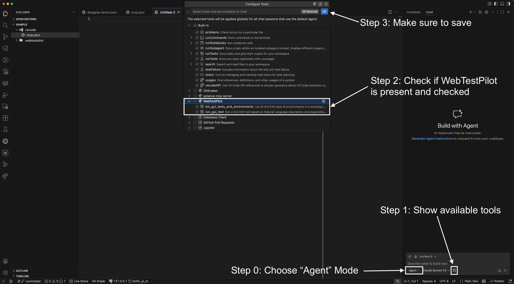
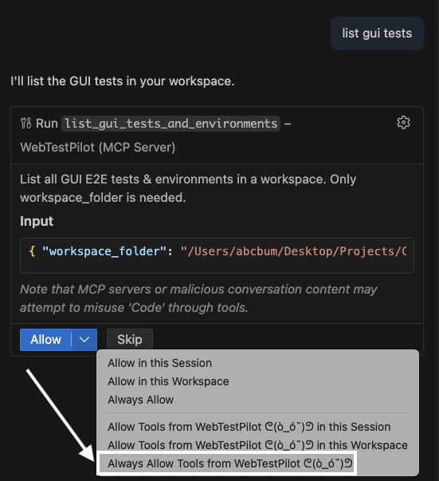

# WebTestPilot MCP Server

## Table of Contents

- [WebTestPilot MCP Server](#webtestpilot-mcp-server)
  - [Table of Contents](#table-of-contents)
  - [Instructions](#instructions)
    - [1. Add GUI test cases to your project](#1-add-gui-test-cases-to-your-project)
    - [2. VSCode](#2-vscode)
      - [2.1. Add MCP to VSCode](#21-add-mcp-to-vscode)
      - [2.2. Test it out](#22-test-it-out)
    - [3. Trae](#3-trae)
      - [3.1 Add MCP Server to Trae](#31-add-mcp-server-to-trae)
      - [3.2 Test it out](#32-test-it-out)

## Instructions
### 1. Add GUI test cases to your project
Setup testcases in your own project folder.
- Open your project (CTrip, 12306 clone) in VSCode / Trae.
- Move the folder `./sample/.webtestpilot` from this repo to your project folder.
- Update your .env file with latest keys.
- If you use VSCode, read from [2. VSCode](#2-vscode), if Trae, read from [3. Trae](#3-trae)

### 2. VSCode

#### 2.1. Add MCP to VSCode
Steps to add MCP Server to vscode:
1. Ctrl + Shift + P, Search for "MCP: Add server"
2. Choose stdio.
3. Input command as below: (**NOTE:** Modify --env-file path to your computer.)
```
uvx --refresh --env-file "/path/to/folder/WebTestPilot-extension/.env" --from "git+https://github.com/code-philia/WebTestPilot@parallel#subdirectory=webtestpilot" webtestpilot-mcp
```
  
4.  Input Name: "WebTestPilot".
5.  Choose "Workspace" option.

For more details: [Use MCP servers in VSCode](https://code.visualstudio.com/docs/copilot/customization/mcp-servers#_add-an-mcp-server).

**Common errors:** If VSCode can't find uvx:

1. Use `which uvx` to get the path and copy it.
```bash
which uvx
> /Users/your-name/.local/bin/uvx
> C://Users/your-name/uvx
```
1. Create or open file `.vscode/mcp.json`, edit command to match.
```json
{
	"servers": {
		"WebTestPilot": {
			"type": "stdio",
			"command": "/Users/your-name/.local/bin/uvx",   <--------- `which uvx` output here.
			"args": [
				"--refresh",
				"--env-file",
				"/path/to/.../WebTestPilot-extension/.env", <--------- make sure .env file is correct.
				"--from",
				"git+https://github.com/code-philia/WebTestPilot@parallel#subdirectory=webtestpilot",
				"webtestpilot-mcp"
			]
		}
	},
	"inputs": []
}
```

#### 2.2. Test it out
- Check if MCP tools are available in Copilot, if yes, good to go!.


- Try asking "list gui tests" or "run a gui test".
- When encounter "Allow" prompt, choose "Always allow tools from WebTestPilot ᕦ(ò_óˇ)ᕤ".



### 3. Trae

#### 3.1 Add MCP Server to Trae
1. Go to Trae Settings.
2. Click MCP
3. Add -> Add Manually
4. Input the following json (**NOTE:** Make sure to update .env paths accordingly)
```json
{
  "mcpServers": {
    "WebTestPilot": {
      "command": "uvx",
      "args": [
        "--refresh",
        "--env-file",
        "/path/to/.../Cophi/WebTestPilot-extension/.env",
        "--from",
        "git+https://github.com/code-philia/WebTestPilot@parallel#subdirectory=webtestpilot",
        "webtestpilot-mcp"
      ]
    }
  }
}
```
5. Click start button if needed.
6. Once started and can see list of tools. Good to go!

#### 3.2 Test it out
- Choose agent: "Builder with MCP".
- Sample questions:
  - "list out gui tests i have"
  - "run invalid phone number on prod"
